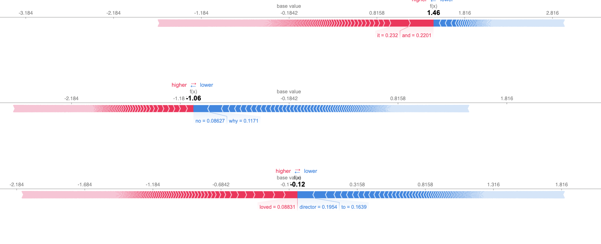

## Tutorial on displaying SHAP force plots in Python HTML
### How to render SHAP force plots on your web application. My solution is in Flask, but hopefully the approach can fit your needs.

[Read the blog post](https://yeqiuu.medium.com/tutorial-on-displaying-shap-force-plots-in-python-html-4883aeb0ee7c)

- Only works for force plots
- Example result:

----

### Steps to reproduce:

- run `app.py`
- see `localhost` result

----
